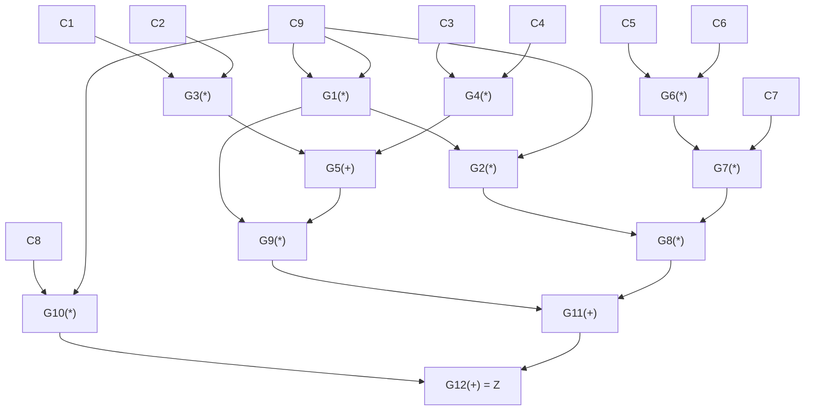

Here a simple walkthrough of constructing a ZkSnark from an arbitrary computation is presented. This walkthrough is based on the common practice
of establishing arithmetic circuits and quadratic arithmetic programs that act as commitments to these circuits. Other constructions such as using KATE polynomial commitments exist, but are not covered here. 

This example is also provided without complete formalism so that it is easier to follow.

# Arithmetic Circuits

## Why do we create arithmetic circuits?
It may seem basic to state that a large amount of computations involve arithmetic, but this fact is central to why ZkSnark constructions begin with arithmetic circuits. Arithmetic circuits allow one to represent the computational structure of the program in a way that enables a proving party to commit to a program, and create modified computation that proves a program leads a specific output.

## How we create arithmetic circuits
Let us say for example that we have the following computation. We we have 9 separate numbers (notably, from a field or ring) multiplied in a specific way that we want to prove equals a result z.

$$\large c5*c6*c7*c9^3 + c1*c2*c9^2 + c3*c4*c9^2 + c8*c9 = z$$

We can represent this computatoin as the following circuit where 2 values are multiplied or added at a time until we reach our the final result of our computation z. The inputs $\large C_{n}$ are called "wires" and the values $\large G_{n}$ with inputs leading into them are called "gates".

Our list of computations in table format look like the following:

$c9*c9 = g1$

$c1*c2 = g3$

$c3*c4 = g4$

$c5*c6 = g6$

$x*c8 = g10$

$c7*g6 = g7$

$g4+g3 = g5$

$g5*g1 = g9$

$c9*g1 = g2$

$g2*g7 = g8$

$g8+g9 = g11$

$g11+g10 = g12$

One thing that has been skipped over is the exact algorithm is used to create this circuit. This is a non-trivial task that we'll address later in this document.

# Constraint Systems

## Why do we create constraint systems?

Since we want both to cryptographically commit AND hide the values we've computed in our arithmetic circuit, we need to work towards a system that in which we can do both. A constraint system is a crucial step towards that. At the end of this explanation we'll revisit why it's necessary.

## What is a constraint system for an arithmetic circuit?
If you look at our computations above, you'll notice that all computations are in the following form:

$Left(*|+)Right = W$

The fact that all 12 of our computations are in this form is used to create something called a "rank 1 constraint system" which will allow us to commit to this series of computations. Explanations about what a "rank 1 constraint system" is are often confusing, but in simple terms it boils down to taking the dot product of a vector of all values computed in the arithmetic circuit by a sparse vector with only a single value of $1$ in it for each of the equations in our circuit above.

The vector of all our values $\vec{s}$ is the following vector: 

$\vec{s} = [1,c9,c1,c2,c3,c4,c5,c6,c7,c8,g1,g2,g3,g4,g5,g6,g7,g8,g9,g10,g11,g12]$ 

Note it includes all of our input values $c_n$, our gate values $g_n$, and $1$. We include 1 so we can represent additions as well.

## Constructing a rank 1 constraint system
Let's look at how we'd represent our first two equations this way.

### Computation #1 - $c9*c9 = g1$

To compute this we'd create three sparse vectors $\vec{l1}$, $\vec{r1}$, and $\vec{w1}$ with 1s at the position in $\vec{s}$ where the variables $c9$ & $g1$ lie 

$\vec{s} = [1,c9,c1,c2,c3,c4,c5,c6,c7,c8,g1,g2,g3,g4,g5,g6,g7,g8,g9,g10,g11,g12]$ 

$\vec{l1} = [0, 1, 0, 0, 0, 0, 0, 0, 0, 0, 0, 0, 0, 0, 0, 0, 0, 0, 0,  0,  0,  0]$

$\vec{r1} = [0, 1, 0, 0, 0, 0, 0, 0, 0, 0, 0, 0, 0, 0, 0, 0, 0, 0, 0,  0,  0,  0]$

$\vec{w1} = [0, 0, 0, 0, 0, 0, 0, 0, 0, 0, 1, 0, 0, 0, 0, 0, 0, 0, 0,  0,  0,  0]$

Then we take the dot product of these vectors and multiply the result to get our original computation

$(\vec{s} \cdot \vec{l1})*(\vec{s} \cdot \vec{r1}) = \vec{s} \cdot \vec{w1}$ 

This works because:

$(\vec{s} \cdot \vec{l1})*(\vec{s} \cdot \vec{r1}) = c9*c9$ and $\vec{s} \cdot \vec{w1} = g1$ 

### Computation #2 - $g3 = c1*c2$

We follow the exact same steps for computation #2

$\vec{l2} = [0, 0, 1, 0, 0, 0, 0, 0, 0, 0, 0, 0, 0, 0, 0, 0, 0, 0, 0,  0,  0,  0]$

$\vec{r2} = [0, 0, 0, 1, 0, 0, 0, 0, 0, 0, 0, 0, 0, 0, 0, 0, 0, 0, 0,  0,  0,  0]$

$\vec{w2} = [0, 0, 0, 0, 0, 0, 0, 0, 0, 0, 0, 0, 1, 0, 0, 0, 0, 0, 0,  0,  0,  0]$

$(\vec{s} \cdot \vec{l2})*(\vec{s} \cdot \vec{r2}) = \vec{s} \cdot \vec{w2}$ 

This works because:

$(\vec{s} \cdot \vec{l2})*(\vec{s} \cdot \vec{r2}) = c1*c2$ and $\vec{s} \cdot \vec{w2} = g3$ 

In general our entire rank1 constraint system would look like [this](https://gist.github.com/iamalwaysuncomfortable/0e9642151a243372ec6d6d87967ef083)

## Generalizing rank 1 constraint systems

When we repeat this process for each equation in our arithmetic circuit - we get an equation for the entire solution vector! 

$\Large  s_i \cdot l_{i,q} *  s_i \cdot r_{i,q} =  s_i \cdot w_{i,q}$

# Quadratic Arithmetic Program (committing to hidden values)

In the previous section we found a way to transform an arithmetic circuit to a vector form. The sum of all of these vectors would then be.

$\Large \sum_{k=1}^n s_i \cdot l_{i,q} * \sum_{k=1}^n s_i \cdot r_{i,q} = \sum_{k=1}^n s_i \cdot w_{i,q}$

where $1 \leq i \leq n$ and $1 \leq q \leq m$ and $v_{i,q}, u_{i,q}, w_{i,q}$ are the left, right, and equality matrices we discovered above.

A quadratic arithmetic program is then the following:

$\Large (\sum_{k=1}^n s_i u_{i,q}(x) * \sum_{k=1}^n s_i v_{i,q}(x) - \sum_{k=1}^n s_i w_{i,q}(x) = 0 )\mod t(x)$
