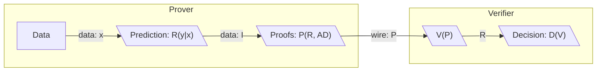
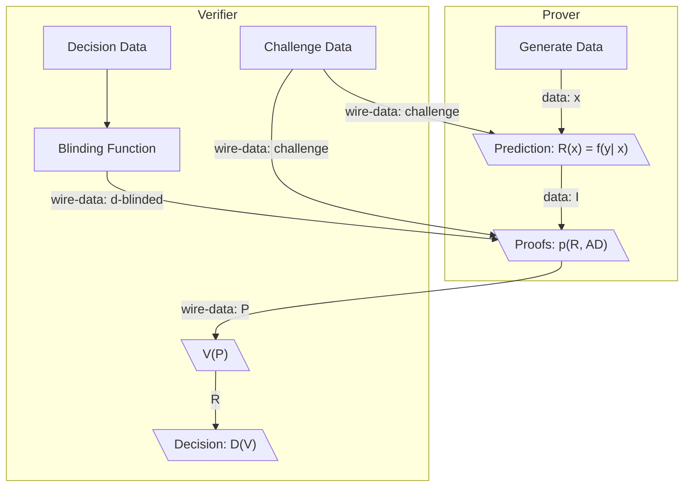
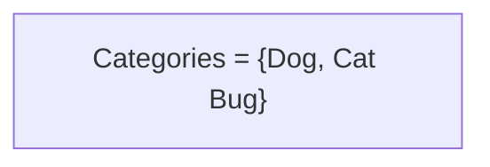
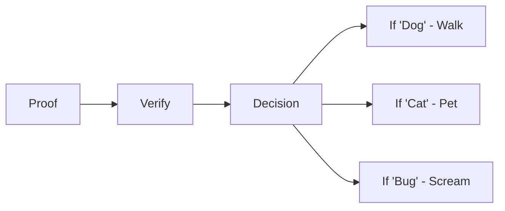
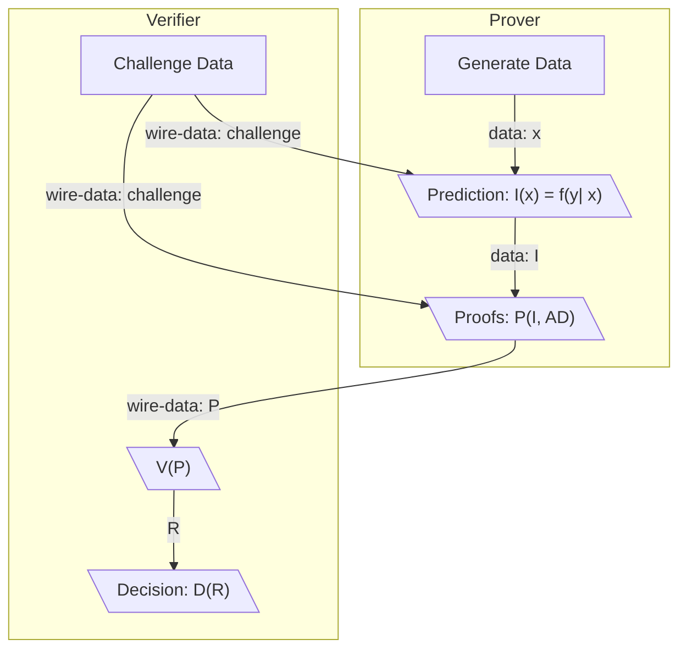

# ZKIP 001 - ZK-Edge - Zero-Knowledge Sharing of Edge Inferences for Use in Decision Functions

# Preface
This document is aimed at an audience that would be able to implement it, thus knowledge of basic cryptography, zero knowledge proof, and machine learning theory is assumed. For a concise introduction to these concepts, [this reference may be helpful](https://arxiv.org/pdf/1907.06381.pdf).

# Summary

ZK-Edge proposes a protocol in which a party can create machine learning inferences and prove relevant details about those inferences to third parties in a way that allows third parties to make decisions based on those proofs without needing to know the original inferences or the data used to generate them. 

# Motivation and Prior Art

Most machine learning models in production accept cleartext data to make predictions. Unfortunately, any data provided by users of online services and the resulting predictions can be assumed to be collected and used without a user's explicit consent. Machine learning is useful to enriching user experience, but society is starting to regard the mass data collection surrounding its usage as an invasion of privacy. Thus we are motivated explore systems which will ensure privacy protection while still employing the useful results of machine learning.

Current efforts exist to create private machine learning, but many focus on homomorphic encryption of the model training pipeline. In practice however, much of the data exposure that happens within machine learning systems happens when prediction is performed. At prediction time, the primary goal of ML algorithms is to provide data in which actionable decisions can be made. Thus, if application developers are able to easily provide systems which allow users to send proofs about what models have discovered about their data instead of the actual data itself, they could still receive information needed to make critical decisions without exposing any user data.

Because prediction is so vital to decisions and is where much data leakage happens, ZK-Edge focuses on securing this process. It provides a framework for a party to share proofs about the results generated by machine learning algorithms with outside parties without sharing the actual predictions or the data used to create them.

# Protocol Overview

ZK-Edge assumes two parties the Prover and the Verifier who both have  capable using a set of prediction functions: 

`I = { f1(y1|X), f2(y2|X), ..., fn(yn|X) }` 

These prediction functions take private input data `X = { x1, x2, ..., xn }` to generate a set of predictions `R`:

`R = { i : r = fx(y | X) }`

They are also capable of using the predictions set `R` and associated a set of associated data `AD` to generate a proof set `P` that proves desired statements `S = { s1, s2, ..., sn }` about that data:

`P = { p1(r1, AD), ..., pn(rn, AD) }` 

They are also both able to send `AD`, `S`, and `P` to each other over the public internet. 

Proofs `P` and associated data `AD` should be structured such that no other party who obtains them gains information about the secret data inputs `X` to the prediction functions nor the resulting prediction set `R` beyond what the proof statement proves. 

Once the proofs `P` are exchanged or posted publicly, verification operations `V` on the proofs can be performed. These verification operations may also use potential decision data `D = { d1, d2, ..., dN }` that the verifying party creates. The result of the verification function `V` can then be used as inputs verifier's program `D` to make decisions.

In certain cases either party may use hiding functions `H` on sensitive data `X`, `R`, or `D` to create hidden versions of the sensitive data `HX`, `HR` and `HD` respectively that are needed for proofs. The hiding function should produce an output that is as close to perfectly hiding as possible and should be computationally discrete log hard to reverse.

Shown below is a graphic representation of the basic information flow ZK-Edge desires to to achieve.

A complete implementation of the protocol will need to include several extra components to ensure that statements about data are indeed what the proofs prove as well as descriptions about how proofs are constructed and their correctness is verified. A more complete summary of the protocol which includes challenges to ensure the right prediction function and proof sets are run would look like the following:

Implementation level details and more complete diagrammatic representations of ZK-Edge is laid out in the `Protocol Description` section below.

# Protocol Goals

## Privacy Goals

For two parties using ZK-Edge, it is assumed they both have the following data they don't want to reveal to each other or other parties:
  * Sensitive data `X` that serves as inputs to prediction functions `F`
  * Predictions `R` which by definition are statistics about Prover or the Verifier's data
  * Decision parameters `D` which reveal the preferences of the parties receiving the inference proofs `P`

The following privacy goals are thus established based on this information sensitivity:

1. **Sensitive Data Owned By a Party Shouldn't Be Exposed to Other Parties:** Ensure all sensitive data `X`, predictions `P` and decision parameters `D` are never directly exposed to parties except for the party that generated these data.

2. **Hidden Secrets Reveal No Information:** Collection of hidden versions of data `P`, `HD`, `HI` and `HR` by the intended counterparty or any third party do not reveal any information

3. **Proofs Should Not Invadvertently Leak Secrets:** Secrets are not discoverable over multiple proofs. This will necessitate the use of cryptographic pratices such as using appropriate blinding factors, using appropriately strong sources of randomness or determinstic sources of it, NOT re-using randomn numbers, etc.
   
4. **Public Proof Statements Should't Lead to Reconstruction of Original Data:** It should be impossible to gain significant information about the original data beyond the narrow scope of public or semi-public proof statements 

## Non-Goals 

1. **Statements Can Be Public:** Statements are not meant to be hidden and can be published publicly or a be decryptable into cleartext by the counterparty
   
2. **Proved Statements can be Statistics:** The protocol is meant to protect against mining of data sent to a counterparty. It does not however prevent the results of what's proved from becoming a statistic itself. It is left to the protocol implementors how much information public statements being proved reveal
   
3. **Not Fully Homomorphic ML:** The protocol posits that the machine learning functions and data inputs `f(y|x)` themselves are not required to be encrypted so long as they do not leave an environment trusted by the protocol user. This does not **prevent** one from using a fully homomorphic encryption scheme with this protocol however.

# Protocol Description

## Proving Statements About Inferences
Most prediction functions within supervised learning contexts output categorical or ordered data. Proof families that make statements about these type of data (most often being statements range and set membership) are of primary interest. 

Within these families, constraints arising from how predictions are used provide the selection criteria for which concrete proving systems to choose. Common constraints are outlined below and inform concrete recommendations for proof families within ZkEdge.

| Protocol Concern | Level | Desired Proof Characteristics | Example | 
| -- | -- | -- | -- |
| Frequency of Prediction | High | Short proving time, Non-Interactivity, Small Proof Size | Chat Applicaton
| Bandwidth | Low | Small Proof Size | Mobile Application |
| Verifier Resources | Low | Small Proof Size, Short Verification, Time | Mobile Application |
| Decision Speed Requirement | High | Non-Interactivity, Short Verification  | Financial Application

## Proof Invariants
In all cases the following invariants apply:
- **Prediciton Functions are the same amongst all parties:** The prover and Verifier agree on the exact set of Functions `F` that will be run in order to provide the inference. This includes agreement on the function's weights and inference modes. How this agreement is reached is explained in the "Requirements for Correctness" section.
- **Data formats are agreed upon by all parties:** Given output formats can vary widely, concrete agreement is necessary on data formatting between all parties.
- **Well-Defined Proving System:** The protocol provides a finite set of well defined proof methods `P` within it's API. New methods should not be able to be arbitrarily introduced. The Prover and Verifiers agree on the proofs used and verifiers have methods for verifying proof methods in a zero knowledge fashion
- **Public Statements** The statements to be proved are public to all parties and verifiers can verify proofs are about these statements

## Proofs About Ordered Data

Ordered data is most often in the form of a small set of ordered values (such credit score brackets) or "continous" outputs which span a large range of values of a core data type (floats, integers, etc.). Decisions on ordered data usually involve choosing ranges the data must lie within in order for specific decisions to made. 

To prove values lie within specific ranges, range proofs are an obvious choice. For small ordered sets, set membership proofs are a secondary option when they have benefits such as non-interactivity, reducing the proof size or lowering the computational resources needed.

## Range Proofs

Most Range Proofs are designed to make statements about integers from a finite integer field of prime order OR about integers between ranges of binary powers (i.e. ${r \epsilon Z, n \epsilon N: 2^0 < r < 2^n}$). The ordering of ML function outputs is the main criteria used for decisions, but often the outputs may be vector valued and may be from sets which are not explicitly numerical or algebraic (an example being: R = {"Very Poor", "Poor", "Fair", "Good", "Excellent"}). 

Given we need integers for most range proofs, if outputs are not already ordered integers, an explicit mapping between the ML function f(y|x) natural outputs and the format used within range proofs is needed. Implementors of this protocol should provide data formatting tools which provide explicit conversions.

An example of available conversions might include those pictured in the table below. The most important consideration is to keep these mappings consistent between the output format of machine learning functions `f(y|x)` and the necessary input formats of the proof set `P`. Once this is achieved range proofs can be used.

| Base Type | Final Type | Operation | Sample Input | Sample Output |
| ------------- | ---------- | ---------- |------------- | -------------- |
| float | integers | truncation | 1.15e9 | 1_150_000_000 |
| float vector | integer vector | truncation | {1.1e3, 2.2e3} | {1100, 2200} |
| float | integers | mapping | 1.15e300 | 1_150_000_000 |
| non-numeric set | integers | mapping | {"A", "B", "C", "D", F"} | {1, 3, 15, 255, 65535} |
| integers | integers | mapping | {1, 2, 3, 4, 5} | {1, 3, 15, 255, 65535} |
| integers | finite scalar | typecast | {1, 2} | {Scalar(1), Scalar(2)} |

### Specific Range Proving Systems
Unfortunately Production grade range proving systems are not yet widely available. Several zero knowledge range proving algorithms are known, but well-audited range proving libraries and services are not yet widely available. The options to implmentors of this protocol are to use the few existing technologies or to self-implement known algorithms.

**Pre-Existing Systems with Robust Support**
* BulletProofs: Works on an inner product argument. Existing concrete implementations.
* ZkSnarks: Requires trusted setup but very quick to verify
* ZkStarks: No truste setup.

**Other Systems with Few-No Implementations**
* Set Based Range Proofs
* Signature Based Range Proofs
* Commitment Based Ranged Proofs

## Proof of Categorical Values

When working with purely categorical predictions, decision logic is slightly harder to develop under a zero-knolwedge assumption about an inference `R`. If a decision predicated upon an inference belonging to a single category, if the verifier knows the result of the decision, they also known which category the prediction made. 

Given this fact, we have several options for categorical proofs

1. **Reveal the Category, but not the data used to prove it** The prover reveals the category, but none of the data used to prove it except for proofs showing that the correct function was run. In this case, a simple encryption or diffe hellman key exchange may be used to simply hide the inference except between the two parties. This may seem to break the invariant of hiding inferences, but in this case the inference can be viewed as the desired statement. 
2. **Prove subset membership** The prover proves the category is within a small subset of total categories. In this case, set proof memberships are the workhorse.
3. **Reveal The Category to a Zero Knowledge Decision Algorithm** In this case the prover sends a hidden result, which is then used to make a decision that is hidden from the verifier. This decision could be creation of encrypted data within a database, a response to the prover only the prover can decode, or a resulting action on a system the verifier cannot view. This option would necessitate creation a zero-knowledge decision protocol, which is beyond the scope of this document. However it is mentioned here for completeness.

### Revealing Categories Directly
In the case where the prover wants to reveal the category - they are able to do so with a simple commitment.

$c = <cat, dog, bug> = <n1, n2, n3>$

$C = n1*G + y*H$

### Proving subet Membership

## Requirements for Correctness
### Ensure the prover is proving the intended statement

In the Protocol Overview above, there is nothing stopping the prover from being creating false "Inferences" out of arbitrary data and sending the proofs about those. Therefore the verifier needs to ensure that the prover is evaluating the expected function.

To prove the function is evaluated correctly the Verifier sends challenge data to be evaluated by the prover within the prediction function and potentially also the proof function. 

This could be verified for instance with a bilinear pairing wherein the prover evaluates the following functions

`f(challenge), f(secret data), f(challenge*secret data)`

The prover then multiplies these as scalar by generator G with a blinding factor known to the prover verifier times a generator H

`f(challenge)*G, f(secret data)*G, f(challenge*secret data)*G `

The verifier then verifies usage of the secret data through a bilinear pairing: 

`e(f(challenge)*G, f(secret data)*g) = e(f(challenge*secret data))`

### Ensure the data being sent from the correct counterparty

When data is sent from a Prover to the Verifier, the verifier needs to ensure that it is actually the prover communicating with them. And conversely the Prover should be able to ensure any challenge data is sent.

This can be done through a signature scheme wherein the Prover and the Verifier sign the data sent to each other.

`sign(data, key material)`

## Requirements for Privacy Preservation

### Ensure underlying data can't be easily discovered when encrypted
Data sent between parties needs to pass through a scheme wherein the data is  computationally discrete log hard to reverse. 

### Ensure proofs don't leak secrets across multiple proofs
A problem could exist 

## Integrating all of the requirements

The protocol thus looks like the following

## Non-Interactivity

## Portability

# Risks
To actually work on mobile devices, we may get unsafe bytes deserializations

# Open Questions
Opn