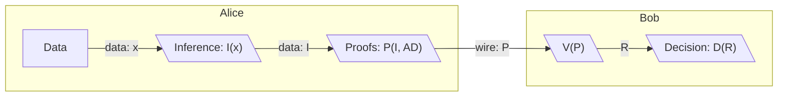
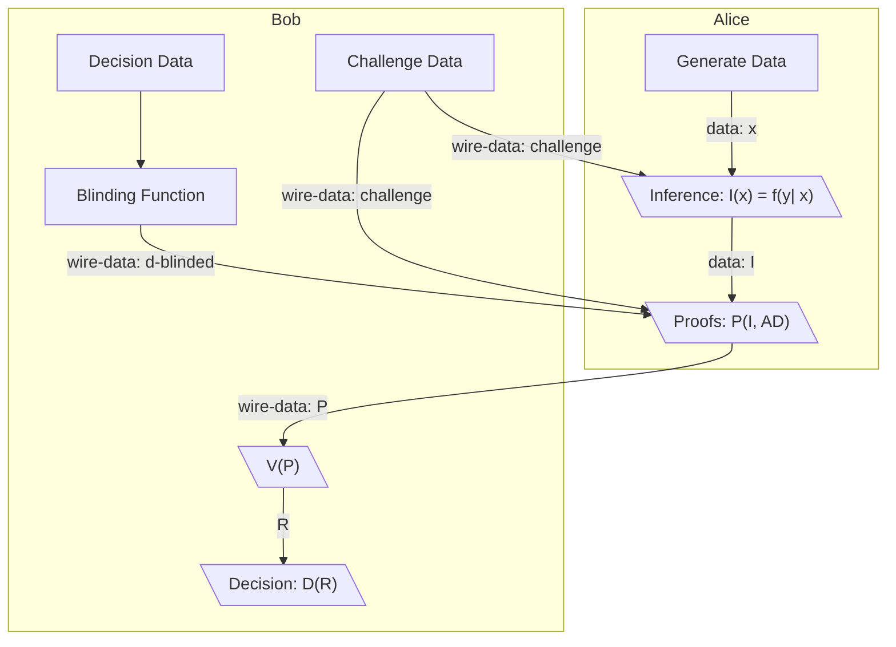
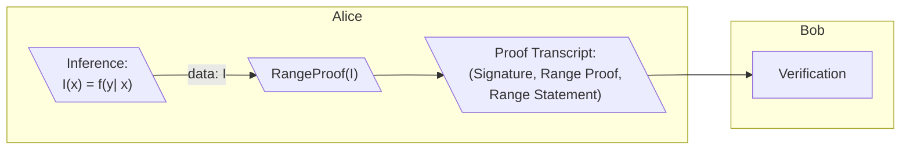
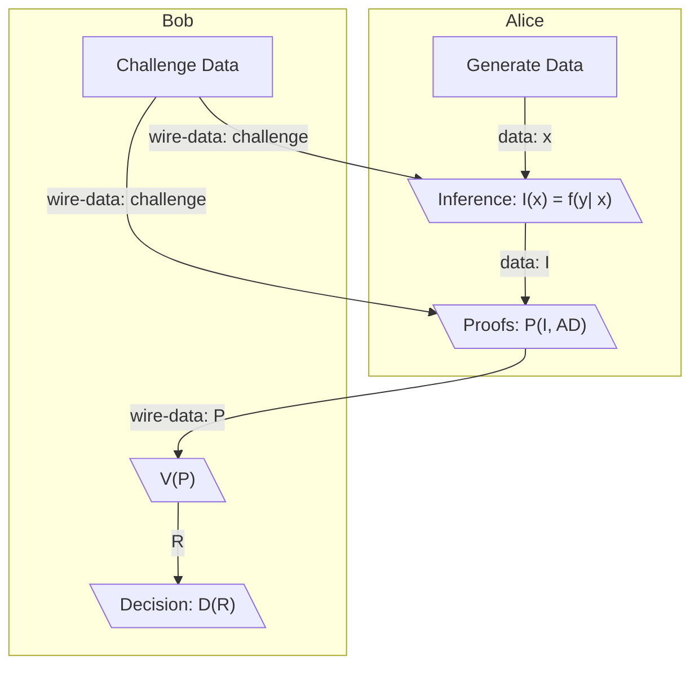

# ZKIP 001 - ZK-Edge - Zero-Knowledge Computation & Sharing of Edge Inferences for Use in Decision Functions

# Summary

ZK-Edge proposes a protocol for creation of machine learning inferences that can be shared between parties which allow 
both parties to make decisions based on the inferences without revealing the content of the inferences or data used to
generate them.

The protocol describes how parties using discriminative machine learning functions of the form `I = f(Y|X)` to generate inferences `I` can hide the content of the inferences through hiding operations `h(I)` which project the inferences into sets in which an adversary with access to `h(I)` cannot feasibly learn anything from and subsequently construct proofs about the content of those inferences `p(h(I))` which counterparties can use within decision logic.

The protocol is designed to be portable and lightweight such almost any two counterparties can run it even if they are both constrained in available computing resources.  

# Motivation

When machine learning is performed within an application in a web browser or mobile device, there is little 
expectation or guarantee of privacy. Any data the user generates and any inferences made from that data can be assumed to be collected by the platform serving the user. These data are often used and sold without a user's explicit consent beyond agreeing to generally opaque platform terms of service.

However, the usefulness of inferences in creating desirable user experiences has arguably been shown.
So it is optimal to not have a binary choice between privacy and utility and motivates the creation
of a system which can provide both.

## Prior Art

Current efforts exist to create private machine learning, but to date many are in research phases and there is a lack of easily usable protocol implementations that allow data protection. Many focus on being able to train models using homomorphic encryption, but there are little available protocols protecting the data used as inputs `inference` functions and the resulting inferences they output. Thus this protocol is focused on enabling easy application-level privacy protection for applications employing machine learning.

# Protocol Overview

## Definitions and Description

ZK-Edge assumes two parties Alice and Bob who are both capable using an inference function `{x : I(x) = f(y | x) }` that takes private input data `x` to generate an inference `I`. 

They are also capable of  using the inference `I` and associated data `AD` to generate a proof set `P = { (x, AD) : P1(I, AD), .., PN(I, AD) }` that proves desired statements `S = {S1, .., SN}` about that data. They are also both able to send `AD`, `S`, and `P` to each other over the public internet. 

Proofs `P` and associated data `AD` should be structured such that no other party who obtains them gains information about the secret data inputs `x` to the inference function nor the resulting inferences `I` beyond what the proof statement proves. Once the proofs `P` are exchanged or posted publicly, verification operations on the proofs can be performed. These verification operations may also intake potential decision data `d = [d1..dN]` that the verifying party creates into a verification function `V(P, [d1..dN]) -> R`. The result of the verification function `R` can then be used as inputs verifier's program `D` to make decisions.

In certain rare cases either party use a hiding function `H` on sensitive data `x`, `I`, or `d` to create hidden versions of subsets of the sensitive data `Hx`, `HI` and `Hd` respectively that are needed for proofs. The hiding function should produce an output that is as close to perfectly hiding as possible and should be discrete log hard to reverse.

## Graphical summary

Shown below is a graphic representation of the basic information flow ZK-Edge desires to to achieve.

A complete implementation of the protocol will need to include several extra components to ensure that statements about data are indeed what the proofs achieve as well as concrete descriptions about how proofs are constructed and their correctness is verified. Thus a better summarical representation would look like the following wherein challenge data is provided beforehand to ensure the correct inferences are run and that the proofs are not about arbitrary statements.

Implementation level details and a more complete diagrammatic representation of ZK-Edge is laid out in the `Protocol Description` section below.

# Protocol Goals

## Privacy Goals

For two parties Alice and Bob using ZK-Edge, it is assumed they both have the following data they don't want to reveal to each other or other parties:
  * Sensitive data `x` that serves as inputs to inference functions `I(x)`
  * Derived inferences `I` which by definition are statistics about Alice or Bob's data
  * Decision parameters `d` which reveal preferences

The following privacy goals are thus established based on this information sensitivity:

1. **Sensitive Data Owned By a Party Shouldn't Be Exposed to Other Parties:** Ensure all sensitive data `x`, inferences `I` and decision parameters `d` are never directly exposed to parties except for the party that generated these data.

2. **Hidden Secrets Reveal No Information:** Collection of hidden versions of data `Hx`, `HI` and `Hd` by a counterparty or any third party do not reveal any information

3. **Proofs Should Not Invadvertently Leak Secrets:** Secrets are not discoverable over multiple proofs. This will necessitate the use of cryptographic pratices such as using appropriate blinding factors, using appropriately strong sources of randomness or determinstic sources of it, NOT re-using randomn numbers, etc.
   
4. **Public Proof Statements Should't Lead to Reconstruction of Original Data:** It should be impossible to gain significant information about the original data beyond the narrow scope of public or semi-public proof statements 

## Non-Goals 

1. **Statements Can Be Public:** Statements are not meant to be hidden and can be published publicly or a be decryptable into cleartext by the counterparty
   
2. **Proved Statements can be Statistics:** The protocol is meant to protect against mining of data sent to a counterparty. It does not however prevent the results of what's proved from becoming a statistic itself. It is left to the protocol implementors what information public statements being proved reveal
   
3. **Not Fully Homomorphic ML:** The protocol posits that the machine learning functions and data inputs `f(y|x)` themselves are not required to be encrypted so long as they do not leave an environment trusted by the protocol user. This does not **prevent** one from using a fully homomorphic encryption scheme with this protocol however.

# Protocol Description

## How a statement about an inference is proved
An inference `I` is assumed to be some kind of numerical statement wherein a continous, ordered, or categorical value is produced.

### Ordered Disecrete or Continous Outputs

* Continous: I(x) = Float in Real Numbers
* Ordered: I(X) = {a: Set A where a is finite and ordered}

In the cases of a continous or an ordered result. A proof of inference can be achieved via a range proof such as bulletproofs or polynomial commitment scheme (such as a KZG scheme)

### Proof of Categorical Values via Set Membership Proofs

Proving Categorical values is slightly harder under the assumption of not learning anything about the Inference I given that categorical variables are unique points. However this can be mitigated by proving that the categorical variable is within a specific subset 

## Requirements for Correctness
### Ensure the prover is proving the intended statement

In the Protocol Overview above, there is nothing stopping the prover from being creating false "Inferences" out of arbitrary data and sending the proofs about those. Therefore the verifier needs to ensure that the prover is evaluating the expected function.

To prove the function is evaluated correctly the Verifier sends challenge data to be evaluated by the prover within the inference function and potentially also the proof function. 

This could be verified for instance with a bilinear pairing wherein the prover evaluates the following functoions

`f(challenge), f(secret data), f(challenge*secret data)`

The prover then multiplies these as scalar by generator G with a blinding factor known to the prover verifier times a generator H

`f(challenge)*G, f(secret data)*G, f(challenge*secret data)*G `

The verifier then verifies usage of the secret data through a bilinear pairing: 

`e(f(challenge)*G, f(secret data)*g) = e(f(challenge*secret data))`

### Ensure the data being sent from the correct counterparty

When data is sent from Alice to Bob, bob needs to ensure that it is actually alice communicating with him. And conversely Alice should be able to ensure any challenge data is sent.

This can be done through a signature scheme wherein Alice and Bob sign the data sent to each other.

`sign(data, key material)`

## Requirements for Privacy Preservation

### Ensure underlying data can't be easily discovered when encrypted
Data sent between parties needs to pass through a scheme wherein the data is  computationally discrete log hard to reverse. 

### Ensure proofs don't leak secrets across multiple proofs
A problem could exist 

## Integrating all of the requirements

The protocol thus looks like the following

## Non-Interactivity

## Portability

# Risks
To actually work on mobile devices, we may get unsafe bytes deserializations

# Open Questions
Opn