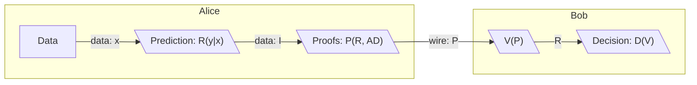
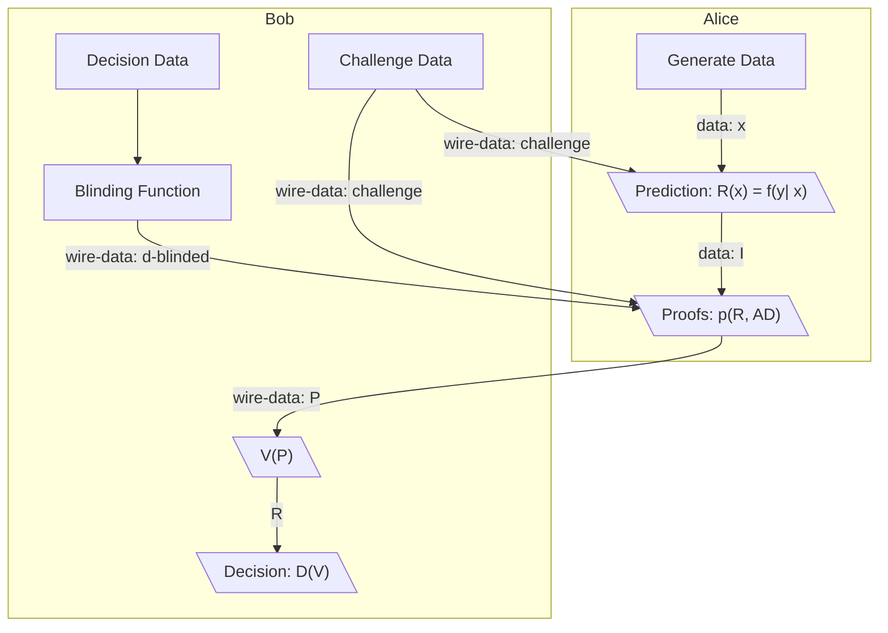
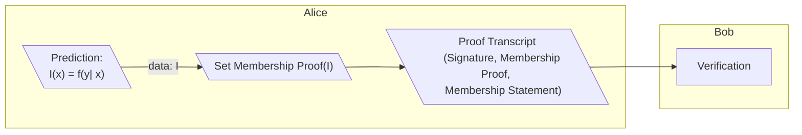
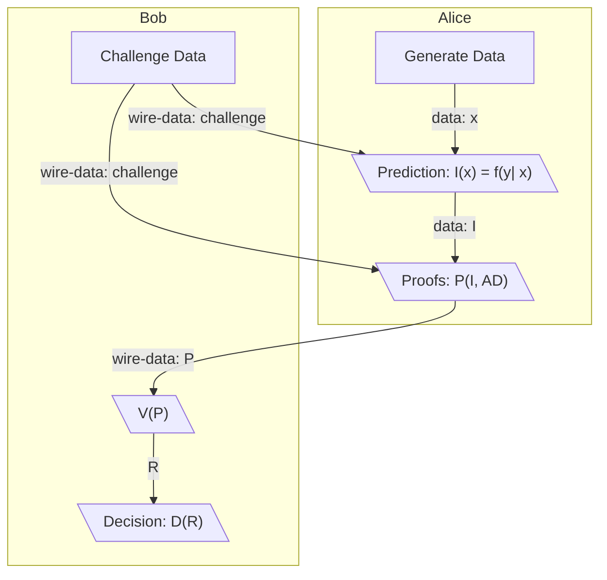

# ZKIP 001 - ZK-Edge - Zero-Knowledge Sharing of Edge Inferences for Use in Decision Functions

# Summary

ZK-Edge proposes a protocol in which a party can create machine learning inferences and prove relevant details about those inferences to third parties in a way that allows third parties to make decisions based on those proofs without needing to know the original inferences or the data used to generate them. 

# Motivation and Prior Art

Most machine learning models in production accept cleartext data to make predictions. Unfortunately, any data provided by users of online services and the resulting predictions can be assumed to be collected and used without a user's explicit consent. Machine learning is useful to enriching user experience, but society is starting to regard the mass data collection surrounding its usage as an invasion of privacy. Thus we are motivated explore systems which will ensure privacy protection while still employing the useful results of machine learning.

Current efforts exist to create private machine learning, but many focus on homomorphic encryption of the model training pipeline. In practice however, much of the data exposure that happens within machine learning systems happens when prediction is performed. At prediction time, the primary goal of ML algorithms is to provide data in which actionable decisions can be made. Thus, if application developers are able to easily provide systems which allow users to send proofs about what models have discovered about their data instead of the actual data itself, they could still receive information needed to make critical decisions without exposing any user data.

Because prediction is so vital to decisions and is where much data leakage happens, ZK-Edge focuses on securing this process. It provides a framework for a party to share proofs about the results generated by machine learning algorithms with outside parties without sharing the actual predictions or the data used to create them.

# Protocol Overview

ZK-Edge assumes two parties Alice and Bob who both have  capable using a set of prediction functions: 

`I = { f1(y1|X), f2(y2|X), ..., fn(yn|X) }` 

These prediction functions take private input data `X = { x1, x2, ..., xn }` to generate a set of predictions `R`:

`R = { i : r = fx(y | X) }`

They are also capable of using the predictions set `R` and associated a set of associated data `AD` to generate a proof set `P` that proves desired statements `S = { s1, s2, ..., sn }` about that data:

`P = { p1(r1, AD), ..., pn(rn, AD) }` 

They are also both able to send `AD`, `S`, and `P` to each other over the public internet. 

Proofs `P` and associated data `AD` should be structured such that no other party who obtains them gains information about the secret data inputs `X` to the prediction functions nor the resulting prediction set `R` beyond what the proof statement proves. 

Once the proofs `P` are exchanged or posted publicly, verification operations `V` on the proofs can be performed. These verification operations may also use potential decision data `D = { d1, d2, ..., dN }` that the verifying party creates. The result of the verification function `V` can then be used as inputs verifier's program `D` to make decisions.

In certain cases either party may use hiding functions `H` on sensitive data `X`, `R`, or `D` to create hidden versions of the sensitive data `HX`, `HR` and `HD` respectively that are needed for proofs. The hiding function should produce an output that is as close to perfectly hiding as possible and should be computationally discrete log hard to reverse.

Shown below is a graphic representation of the basic information flow ZK-Edge desires to to achieve.

A complete implementation of the protocol will need to include several extra components to ensure that statements about data are indeed what the proofs prove as well as descriptions about how proofs are constructed and their correctness is verified. A more complete summary of the protocol which includes challenges to ensure the right prediction function and proof sets are run would look like the following:

Implementation level details and more complete diagrammatic representations of ZK-Edge is laid out in the `Protocol Description` section below.

# Protocol Goals

## Privacy Goals

For two parties Alice and Bob using ZK-Edge, it is assumed they both have the following data they don't want to reveal to each other or other parties:
  * Sensitive data `X` that serves as inputs to prediction functions `F`
  * Predictions `R` which by definition are statistics about Alice or Bob's data
  * Decision parameters `D` which reveal the preferences of the parties receiving the inference proofs `P`

The following privacy goals are thus established based on this information sensitivity:

1. **Sensitive Data Owned By a Party Shouldn't Be Exposed to Other Parties:** Ensure all sensitive data `X`, predictions `P` and decision parameters `D` are never directly exposed to parties except for the party that generated these data.

2. **Hidden Secrets Reveal No Information:** Collection of hidden versions of data `P`, `HD`, `HI` and `HR` by the intended counterparty or any third party do not reveal any information

3. **Proofs Should Not Invadvertently Leak Secrets:** Secrets are not discoverable over multiple proofs. This will necessitate the use of cryptographic pratices such as using appropriate blinding factors, using appropriately strong sources of randomness or determinstic sources of it, NOT re-using randomn numbers, etc.
   
4. **Public Proof Statements Should't Lead to Reconstruction of Original Data:** It should be impossible to gain significant information about the original data beyond the narrow scope of public or semi-public proof statements 

## Non-Goals 

1. **Statements Can Be Public:** Statements are not meant to be hidden and can be published publicly or a be decryptable into cleartext by the counterparty
   
2. **Proved Statements can be Statistics:** The protocol is meant to protect against mining of data sent to a counterparty. It does not however prevent the results of what's proved from becoming a statistic itself. It is left to the protocol implementors how much information public statements being proved reveal
   
3. **Not Fully Homomorphic ML:** The protocol posits that the machine learning functions and data inputs `f(y|x)` themselves are not required to be encrypted so long as they do not leave an environment trusted by the protocol user. This does not **prevent** one from using a fully homomorphic encryption scheme with this protocol however.

# Protocol Description

## Proving Statements About Inferences
The output of most prediction functions is generally  categorical or ordered data. In this section, it is described what can be proved about these data such actionable decisions can be made and how these proofs are constructed.

In all cases the following invariants apply

### Ordered Data

Ordered data is often either in the form of "continous" outputs which span the value of a data type like floats or integers or a small set of ordered values (such credit score brackets) Applications such as price prediction and risk scoring often work by setting a ranged decision threshold based upon this data. For these applications, range proofs provide an excellent method of zero knowledge proving. 

### Proof of Categorical Values via Set Membership Proofs

Proving Categorical values is slightly harder under the assumption of not learning anything about the Prediction I given that categorical variables are unique points. However this can be mitigated by proving that the categorical variable is within a specific subset 

## Requirements for Correctness
### Ensure the prover is proving the intended statement

In the Protocol Overview above, there is nothing stopping the prover from being creating false "Inferences" out of arbitrary data and sending the proofs about those. Therefore the verifier needs to ensure that the prover is evaluating the expected function.

To prove the function is evaluated correctly the Verifier sends challenge data to be evaluated by the prover within the prediction function and potentially also the proof function. 

This could be verified for instance with a bilinear pairing wherein the prover evaluates the following functoions

`f(challenge), f(secret data), f(challenge*secret data)`

The prover then multiplies these as scalar by generator G with a blinding factor known to the prover verifier times a generator H

`f(challenge)*G, f(secret data)*G, f(challenge*secret data)*G `

The verifier then verifies usage of the secret data through a bilinear pairing: 

`e(f(challenge)*G, f(secret data)*g) = e(f(challenge*secret data))`

### Ensure the data being sent from the correct counterparty

When data is sent from Alice to Bob, bob needs to ensure that it is actually alice communicating with him. And conversely Alice should be able to ensure any challenge data is sent.

This can be done through a signature scheme wherein Alice and Bob sign the data sent to each other.

`sign(data, key material)`

## Requirements for Privacy Preservation

### Ensure underlying data can't be easily discovered when encrypted
Data sent between parties needs to pass through a scheme wherein the data is  computationally discrete log hard to reverse. 

### Ensure proofs don't leak secrets across multiple proofs
A problem could exist 

## Integrating all of the requirements

The protocol thus looks like the following

## Non-Interactivity

## Portability

# Risks
To actually work on mobile devices, we may get unsafe bytes deserializations

# Open Questions
Opn